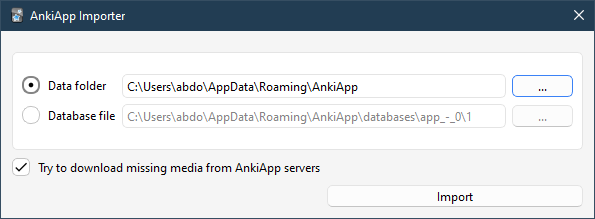

# AnkiApp Importer

An [Anki](https://apps.ankiweb.net/) add-on to import decks from the copycat [AnkiApp](https://www.ankiapp.com/).

It appears that AnkiApp started to [paywall the deck export feature](https://www.reddit.com/r/Anki/comments/ocbhry/help_to_bypass_ankiapps_paywall_for_deck_export/).
So you can no longer export a zip of your cards [without paying](https://www.ankiapp.com/support/solutions/ddcf01b0/can-i-export-my-flashcards-from-ankiapp-/).

This add-on salvages the cards from the SQLite database and was inspired by the Reddit post linked above.
It can import cards, decks, note types, and media files.

## How to Use

-   Download the add-on from https://ankiweb.net/shared/info/2072125761
-   Make sure all your AnkiApp decks are downloaded before using the add-on. For that, go to AnkiApp, click on each of your decks, then click on the Download button at the bottom if it's shown.
-   Run Anki and go to **Tools > Import From AnkiApp**. The add-on tries to detect AnkiApp's data folder on your system automatically. If you see the "Data folder" field already populated, you can go ahead and click Import. You can also specify a different folder location, or a single SQLite database file by checking the "Database file" option (only recommened if you don't have access to the whole data folder for some reason, as the add-on may need other files in the data folder to properly import notetypes).

## Notes & Known Issues

-   Study progress is not imported.
-   AnkiApp doesn't seem to keep any info on the positions of note type fields, so an empty field will cause
    Anki to refuse to import its note if it happened to be imported as the first field.
    To prevent that, the add-on fills all empty fields with a non-breaking space.

## References

-   [AnkiApp is not part of the Anki ecosystem - Frequently Asked Questions](https://faqs.ankiweb.net/ankiapp-is-not-part-of-the-anki-ecosystem.html) (with some notes about importing if you have a zip file)
-   [Help to bypass Ankiapp's paywall for deck export : Anki | Reddit](https://www.reddit.com/r/Anki/comments/ocbhry/help_to_bypass_ankiapps_paywall_for_deck_export/)
-   [AnkiApp - Support | Can I export my flashcards from AnkiApp?](https://www.ankiapp.com/support/solutions/ddcf01b0/can-i-export-my-flashcards-from-ankiapp-/)

## Changelog

See [CHANGELOG.md](CHANGELOG.md) for a list of changes.

## Support & feature requests

Please post any questions, bug reports, or feature requests in the [support page](https://forums.ankiweb.net/t/ankiapp-importer/16734/) or the [issue tracker](https://github.com/abdnh/AnkiApp-importer/issues).

If you want priority support for your feature/help request, I'm available for hire.
You can get in touch from the aforementioned pages, via [email](mailto:abdo@abdnh.net) or on [Fiverr](https://www.fiverr.com/abd_nh).

## Support me

Consider supporting me if you like my work:

I'm also available for freelance add-on development on Fiverr:

