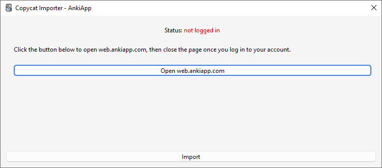

# Copycat Importer

An [Anki](https://apps.ankiweb.net/) add-on to import decks from copycat apps such as [AnkiApp](https://www.ankiapp.com/) and [AnkiPro](https://ankipro.net/).

## AnkiApp

Go to _Tools > Copycat Importer > Import from AnkiApp_.

Several methods to import AnkiApp decks are supported. All methods generally support importing cards, decks, note types, and media files:

### Data folder

If you have AnkiApp installed on your computer, it's recommended to try this option first. The add-on tries to detect the location of your AnkiApp data and fill in the Data folder field with its path. You need to make sure all your AnkiApp decks are downloaded locally before using this option. For that, go to AnkiApp, click on each of your decks, then click on the Download button at the bottom if it's shown.

### Database files

If you only have SQLite database files instead of a full data folder (such as the files stored in the databases subfolder of the data folder), you can use this option.
This is only recommened if you don't have access to the whole data folder for some reason, as the add-on may need other files in the data folder to properly import notetypes.

### XML zips

If the Export button under the three-dot menu in AnkiApp is enabled for your account, you can use it to export a zip file and use this option to import the deck.

If the button is greyed out, see [this](https://forums.ankiweb.net/t/copycat-importer-ankiapp-ankipro/16734/214?u=abdo) for a workaround.

### Known Issues

-   Study progress is not imported.
-   AnkiApp doesn't seem to keep any info on the positions of note type fields, so an empty field will cause
    Anki to refuse to import its note if it happened to be imported as the first field.
    To prevent that, the add-on fills all empty fields with a non-breaking space.

## AnkiPro

The add-on works by downloading your decks from the AnkiPro site. Go to _Tools > Copycat Importer > Import from AnkiPro_ and follow the instructions.

### Known Issues

-   Importing of [library decks](https://ankipro.net/library) is not supported. Since they are simply scraped from AnkiWeb, you can search and download the decks from [AnkiWeb](https://ankiweb.net/shared/decks) instead.
-   Importing of study progress and deck options is not supported yet.

## Download

You can download the add-on from AnkiWeb: [2072125761](https://ankiweb.net/shared/info/2072125761)

## References

-   [Anki knockoffs](https://faqs.ankiweb.net/anki-knockoffs.html)
-   [Help to bypass Ankiapp's paywall for deck export : Anki | Reddit](https://www.reddit.com/r/Anki/comments/ocbhry/help_to_bypass_ankiapps_paywall_for_deck_export/)
-   [AnkiApp - Support | Can I export my flashcards from AnkiApp?](https://www.ankiapp.com/support/solutions/ddcf01b0/can-i-export-my-flashcards-from-ankiapp-/)
-   [AnkiPro: Another ripoff Anki app - AnkiMobile (iPhone/iPad) - Anki Forums](https://forums.ankiweb.net/t/ankipro-another-ripoff-anki-app/11791)

## Changelog

See [CHANGELOG.md](CHANGELOG.md) for a list of changes.

## Support & feature requests

Please post any questions, bug reports, or feature requests in the [support page](https://forums.ankiweb.net/t/ankiapp-importer/16734/) or the [issue tracker](https://github.com/abdnh/anki-copycat-importer/issues).

If you want priority support for your feature/help request, I'm available for hire.
You can get in touch from the aforementioned pages, via [email](mailto:abdo@abdnh.net) or on [Fiverr](https://www.fiverr.com/abd_nh).

## Support me

Consider supporting me if you like my work:

I'm also available for freelance add-on development on Fiverr:

