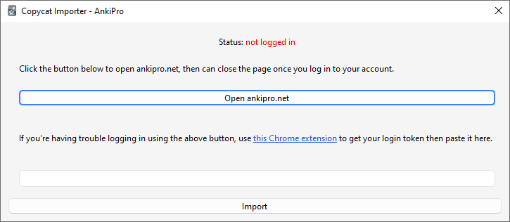

# Copycat Importer

An [Anki](https://apps.ankiweb.net/) add-on to import decks from copycat apps such as [AnkiApp](https://www.ankiapp.com/) and [Noji (formerly AnkiPro)](https://noji.io/).

## AnkiApp

The add-on works by downloading your decks from the AnkiPro site. Go to _Tools > Copycat Importer > Import from AnkiApp_ and follow the instructions.

### Known Issues

- Study progress is not imported.

## AnkiPro

The add-on works by downloading your decks from the AnkiPro site. Go to _Tools > Copycat Importer > Import from AnkiPro_ and follow the instructions.

### Known Issues

- Importing of study progress and deck options is not supported yet.
- Importing of image occlusion cards is not supported.
- AnkiPro is [trying](https://forums.ankiweb.net/t/copycat-importer-ankiapp-ankipro/16734/345) to [prevent](https://forums.ankiweb.net/t/copycat-importer/43883) people from exporting their decks using this add-on. You can use [this Chrome extension](https://chromewebstore.google.com/detail/ghmmlnlfpghgbecgkiananhlbfakmcpd) to get your login token then paste it in the text field if you're having trouble logging in via the add-on.

## Download

You can download the add-on from AnkiWeb: [2072125761](https://ankiweb.net/shared/info/2072125761)

## References

- [Anki knockoffs](https://faqs.ankiweb.net/anki-knockoffs.html)
- [Help to bypass Ankiapp's paywall for deck export : Anki | Reddit](https://www.reddit.com/r/Anki/comments/ocbhry/help_to_bypass_ankiapps_paywall_for_deck_export/)
- [AnkiApp - Support | Can I export my flashcards from AnkiApp?](https://www.ankiapp.com/support/solutions/ddcf01b0/can-i-export-my-flashcards-from-ankiapp-/)
- [AnkiPro: Another ripoff Anki app - AnkiMobile (iPhone/iPad) - Anki Forums](https://forums.ankiweb.net/t/ankipro-another-ripoff-anki-app/11791)

## Changelog

See [CHANGELOG.md](CHANGELOG.md) for a list of changes.

## Support & feature requests

Please post any questions, bug reports, or feature requests in the [support page](https://forums.ankiweb.net/t/copycat-importer-ankiapp-ankipro/16734) or the [issue tracker](https://github.com/abdnh/anki-copycat-importer/issues).

If you want priority support for your feature/help request, I'm available for hire.
Get in touch via [email](mailto:abdo@abdnh.net) or the UpWork link below.

## Support me

Consider supporting me if you like my work:

I'm also available for freelance add-on development:

