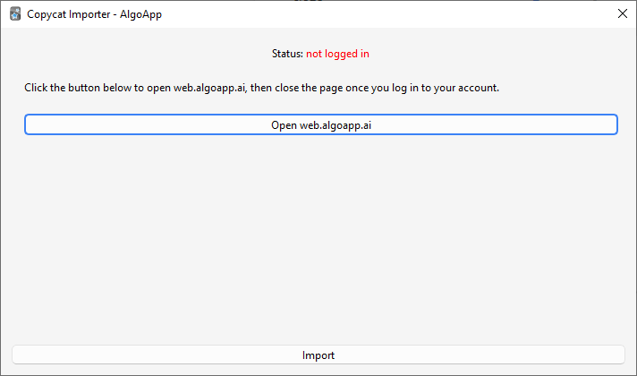

# AlgoApp (formerly AnkiApp)

The add-on works by downloading your decks from the [AlgoApp](https://www.algoapp.ai/) website:

1. Go to _Tools > Copycat Importer > Import from AlgoApp_.
2. Click the _Open_ button.
3. A new window will pop up. Log in to your AlgoApp account there then close the window.
4. The status text should change to "logged in" in green if the login is successful. Now click the _Import_ button.

## Known Issues

Study progress is not imported.
