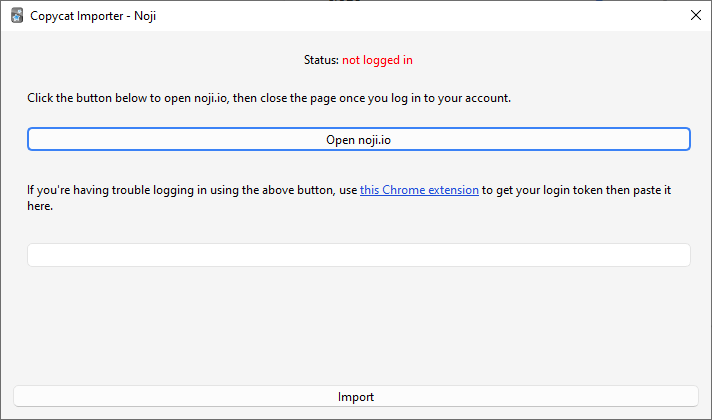

# Noji (formerly AnkiPro)

The add-on works by downloading your decks from the [Noji](https://noji.io/) website:

1. Go to _Tools > Copycat Importer > Import from Noji_.
2. Click the _Open_ button.
3. A new window will pop up. Log in to your Noji account there then close the window.
4. The status text should change to "logged in" in green if the login is successful. Now click the _Import_ button.

## Known Issues

- Importing of study progress and deck options is not supported yet.
- Importing of image occlusion cards is not supported.
- Noji is [trying](https://forums.ankiweb.net/t/copycat-importer-ankiapp-ankipro/16734/345) to [prevent](https://forums.ankiweb.net/t/copycat-importer/43883) people from exporting their decks using this add-on. You can use [this Chrome extension](https://chromewebstore.google.com/detail/ghmmlnlfpghgbecgkiananhlbfakmcpd) to get your login token then paste it in the text field if you're having trouble logging in via the add-on.
